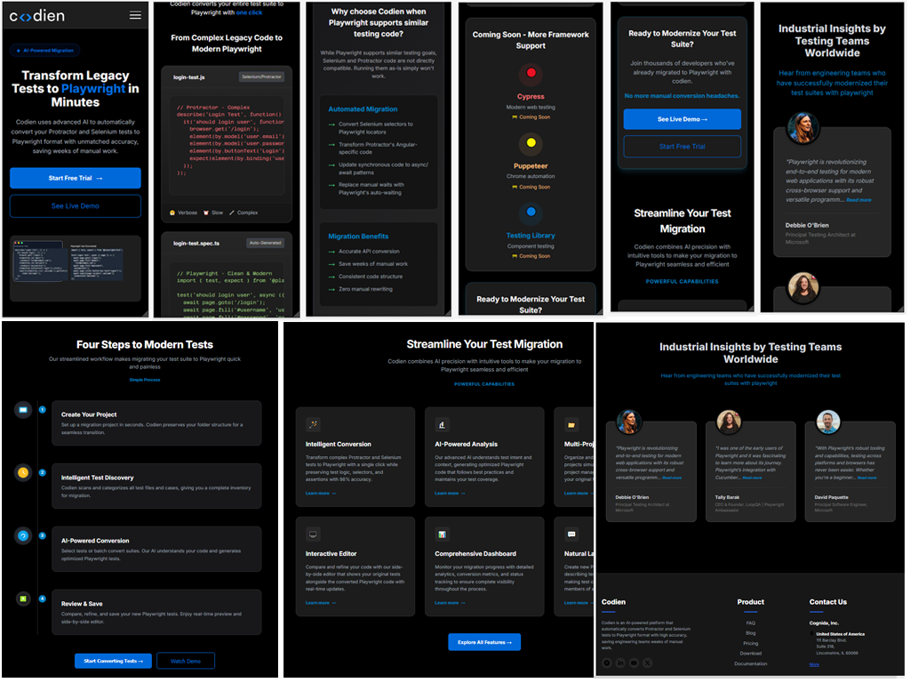

# Codien — AI-Powered Test Migration Platform

[English](#english) | [Русский](#русский)

---

## 🌍 English Description
Codien is a high-tech landing page for a platform that automates test suite migration. This project focuses on clean code, modular SCSS architecture, and flawless responsiveness.

### ✨ Key Features
* **Fully Responsive:** Scales from 320px to UltraWide screens.
* **Modular SCSS:** Organized styles using BEM methodology.
* **Interactive UI:** Custom timeline, complex grid layouts, and smooth animations.

### 📸 Preview

---

## 🇷🇺 Описание на русском
Codien — это современный лендинг для платформы автоматизированной миграции тестов. В проекте реализована чистая семантическая верстка, модульная структура стилей и полная адаптивность.

### ✨ Ключевые особенности
* **Полная адаптивность:** Идеальное отображение на любых устройствах (от 320px).
* **Модульный SCSS:** Чистая архитектура стилей с использованием методологии БЭМ.
* **Сложные UI-элементы:** Интерактивный таймлайн, карточки с вылетающими аватарами и кастомное мобильное меню.

### 🛠 Технологии / Tech Stack
* HTML5 (Semantic)
* SASS / SCSS
* Flexbox & CSS Grid
* BEM Methodology

## 📦 Installation
1. Clone the repo: `git clone https://github.com/akir19/saas-project.git`
2. Open in VS Code.
3. Run Sass Watcher.